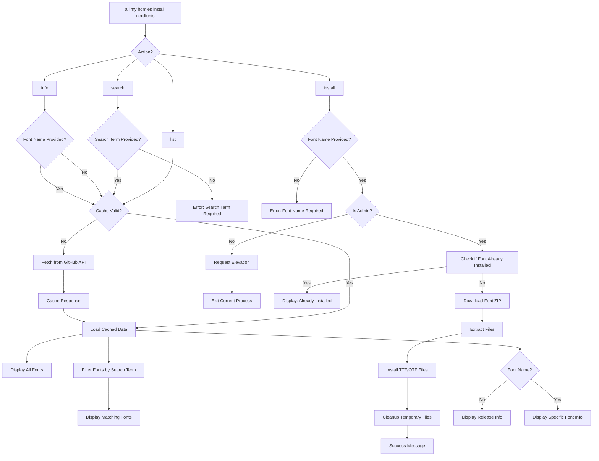

# Nerd Fonts Command Flow Diagram



## Cache System

The nerdfonts command implements a smart caching system:

1. **Cache Location**: `$env:LOCALAPPDATA\AMH2W\Cache\nerdfonts-release.json`
2. **Cache Duration**: 24 hours
3. **Force Refresh**: Use `-ForceRefresh` parameter to bypass cache
4. **Cache Contents**: Complete GitHub API release response including all font assets

## Installation Process

When installing a font, the system:

1. Checks for administrator privileges
2. Elevates if needed (keeping window open for feedback)
3. Searches for the font in release assets (case-insensitive)
4. Checks if font is already installed by looking for common display name patterns
5. Downloads the font using the `fetch` utility
6. Extracts TTF and OTF files
7. Installs each font file to `C:\Windows\Fonts`
8. Cleans up temporary files

## Error Handling

The command uses the Result pattern throughout:
- `Ok` results contain the requested data or success status
- `Err` results contain descriptive error messages
- All operations are wrapped in try/catch blocks
- Logging is used for diagnostic information

## Usage Examples

```powershell
# List all fonts with caching
all my homies install nerdfonts list

# Force fresh data from GitHub
all my homies install nerdfonts list -ForceRefresh

# Search for fonts
all my homies install nerdfonts search "Fira"

# Install a font (prompts for elevation)
all my homies install nerdfonts install FiraCode

# Get release information
all my homies install nerdfonts info

# Get specific font information
all my homies install nerdfonts info "JetBrainsMono"
```
